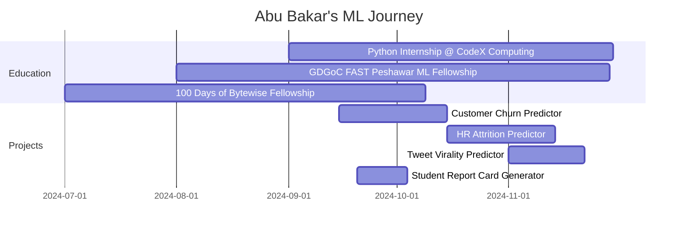

<h1 align="center">
    
</h1>

<h3 align="center">Machine Learning Engineer & Data Scientist from Pakistan</h3>

<div align="center">
  
  [](https://git.io/streak-stats)
  
  
</div>

<div align="center">
  
</div>

## 🔍 About Me

```python
class ComputerScientist:
    def __init__(self):
        self.name = "Abu Bakar"
        self.role = "Machine Learning Developer"
        self.language_spoken = ["en_US", "ur_PK"]
        self.current_focus = ["Machine Learning", "Generative AI", "Data Analysis"]
        self.experience = [
                            # Data Analysis
                            "Exploratory Data Analysis", "Statistical Analysis", "Data Visualization", 
                            "Feature Engineering", "Data Preprocessing", "Time Series Analysis",
                            "Data Cleaning",
                            
                            # Machine Learning
                            "Classification", "Regression", "Clustering", "Random Forests",
                            "Neural Networks", "Transfer Learning", "Reinforcement Learning",
                            "Anomaly Detection", "Recommender Systems", "Feature Selection",
                            
                            # Generative AI
                            "GANs", "Diffusion Models", "Transformers", "Large Language Models",
                            "Text-to-Image Generation", "Stable Diffusion", "Prompt Engineering",
                            "Text Generation", "Code Generation", "Fine-tuning LLMs",
                            "Multimodal AI", "Vector Embeddings", "Semantic Search"
                        ]
    
    def say_hi(self):
        print("Thanks for dropping by! Let's collaborate on ML projects together!")

me = ComputerScientist()
me.say_hi()
```

## 🔭 Current Focus
  
- **Python Internship @ CodeX Computing Co**
  - Developing real-world Python applications
  - Working on weekly tasks and projects
  
- **Air Quality Analysis Project**
  - Data analysis and visualization project
  - Analyzing environmental data patterns
  - [View Repository](https://github.com/abubakarp789/Air_Quality_Analysis)

## 🎓 Education & Certifications

<div align="center">
  
  
  
</div>

## 🏆 GitHub Trophies

<div align="center">
  
</div>

## 📊 GitHub Stats

<div align="center">
  
  
</div>

<div align="center">
  
</div>

## 🛠️ Tech Stack & Tools

<div align="center">
  <h3>🧠 ML & Data Science</h3>
  <p>
    
    
    
    
    
    
    
    
    
  </p>
  
  <h3>💻 Languages & Frameworks</h3>
  <p>
    
    
    
    
    
    
  </p>
  
  <h3>🔧 Tools & Platforms</h3>
  <p>
    
    
    
    
    
    
  </p>
</div>

## 📂 Featured Projects

<table>
  <tr>
    <td width="50%">
      <h3 align="center">Customer Churn Predictor</h3>
      <div align="center">
        <a href="https://github.com/abubakarp789/Churn_Predictor" target="_blank">
          
        </a>
        <p>
          <a href="https://github.com/abubakarp789/Churn_Predictor" target="_blank">
            
          </a>
          <a href="https://churn-predictor-ipp1.onrender.com/" target="_blank">
            
          </a>
        </p>
        <p><strong>Python, Flask, scikit-learn, Bootstrap 5</strong> — A professional machine learning web application for predicting customer churn with interactive dashboards.</p>
      </div>
    </td>
    <td width="50%">
      <h3 align="center">HR Attrition Predictor</h3>
      <div align="center">
        <a href="https://github.com/abubakarp789/HR-Attrition-Predictor" target="_blank">
          
        </a>
        <p>
          <a href="https://github.com/abubakarp789/HR-Attrition-Predictor" target="_blank">
            
          </a>
          <a href="https://hrattritionpredictor56.streamlit.app/" target="_blank">
            
          </a>
        </p>
        <p><strong>Python, Streamlit, sklearn, Pandas</strong> — ML-powered app that predicts employee attrition with 97.96% accuracy and delivers actionable HR insights.</p>
      </div>
    </td>
  </tr>
  <tr>
    <td width="50%">
      <h3 align="center">Tweet Virality Predictor</h3>
      <div align="center">
        <a href="https://github.com/abubakarp789/Viral_or_Not-Predicting_Virality_of_Tweets" target="_blank">
          
        </a>
        <p>
          <a href="https://github.com/abubakarp789/Viral_or_Not-Predicting_Virality_of_Tweets" target="_blank">
            
          </a>
          <a href="https://viral-or-not-predicting-virality-of.onrender.com/" target="_blank">
            
          </a>
        </p>
        <p><strong>Flask, scikit-learn, NLP</strong> — An AI-powered web application that predicts tweet virality potential with 85% accuracy.</p>
      </div>
    </td>
    <td width="50%">
      <h3 align="center">ML Fellowship Projects</h3>
      <div align="center">
        <a href="https://github.com/abubakarp789/Machine-Learning-Fellowship-GDGoC-FAST-Peshawar" target="_blank">
          
        </a>
        <p>
          <a href="https://github.com/abubakarp789/Machine-Learning-Fellowship-GDGoC-FAST-Peshawar" target="_blank">
            
          </a>
        </p>
        <p><strong>Python, ML, Data Analysis</strong> — A collection of machine learning projects from data preprocessing to model deployment as part of the GDGoC Fellowship.</p>
      </div>
    </td>
  </tr>
  <tr>
    <td width="50%">
      <h3 align="center">Python Internship Portfolio</h3>
      <div align="center">
        <a href="https://github.com/abubakarp789/Python-Internship-CodeX-Computing-Co" target="_blank">
          
        </a>
        <p>
          <a href="https://github.com/abubakarp789/Python-Internship-CodeX-Computing-Co" target="_blank">
            
          </a>
        </p>
        <p><strong>Python, OOP, File Processing</strong> — A comprehensive portfolio of Python projects and assignments from my internship at CodeX Computing Co.</p>
      </div>
    </td>
    <td width="50%">
      <h3 align="center">100 Days of ML/DL Bytewise Fellowship</h3>
      <div align="center">
        <a href="https://github.com/abubakarp789/100DaysOfBytewiseFellowship" target="_blank">
          
        </a>
        <p>
          <a href="https://github.com/abubakarp789/100DaysOfBytewiseFellowship" target="_blank">
            
          </a>
        </p>
        <p><strong>Python, TensorFlow, Data Science</strong> — Documenting my 100-day journey of machine learning exploration with daily code updates and projects.</p>
      </div>
    </td>
  </tr>
</table>

## 📅 Timeline of My Learning Journey



## 📫 Connect With Me

<div align="center">
  <a href="mailto:abubakarp789@gmail.com">
    
  </a>
  <a href="https://www.linkedin.com/in/abubakar56" target="_blank">
    
  </a>
  <a href="https://www.kaggle.com/abubakarpanhwar" target="_blank">
    
  </a>
  <a href="https://huggingface.co/abubakar56" target="_blank">
    
  </a>
</div>

<h3 align="center">
    
</h3>

<a href="https://holopin.io/@abubakarp789" title="View my Holopin profile">
   
</a>
