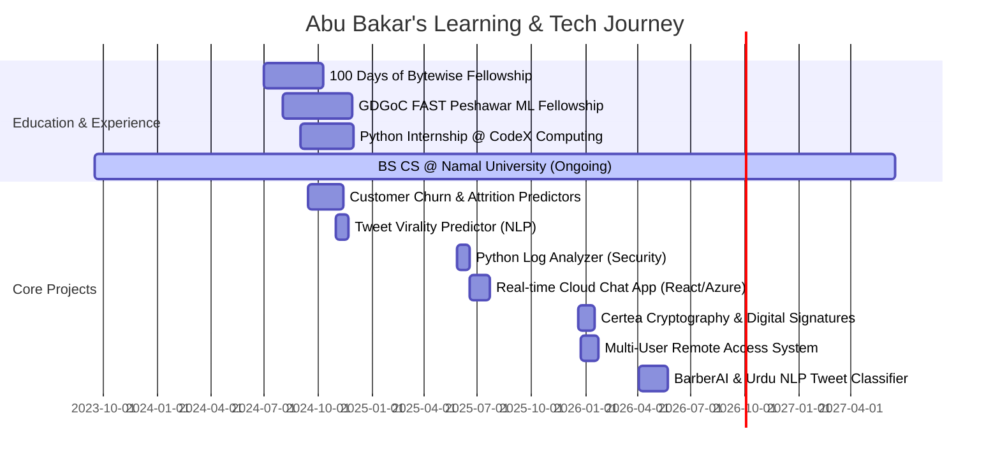

<h1 align="center">
    
</h1>

<h3 align="center">Machine Learning Engineer & Data Scientist from Pakistan</h3>

<div align="center">
  
  [](https://git.io/streak-stats)
  
  
</div>

<div align="center">
  
</div>

## 🔍 About Me

```python
class ComputerScientist:
    def __init__(self):
        self.name = "Abu Bakar"
        self.role = "Machine Learning & Software Engineer"
        self.language_spoken = ["en_US", "ur_PK"]
        self.current_focus = ["Machine Learning", "Generative AI", "Distributed Systems", "Cybersecurity"]
        self.experience = [
                            # Machine Learning & NLP
                            "NLP", "Urdu Sentiment & Emotion Analysis", "Large Language Models",
                            "Transformers", "Neural Networks", "Random Forests", "Transfer Learning",
                            "Classification", "Regression", "Clustering", "Prompt Engineering",
                            
                            # Parallel & Distributed Systems
                            "Parallel Computing", "Distributed Socket Systems", "Multi-user Systems",
                            
                            # Cybersecurity & Cryptography
                            "Log Analysis", "Threat Detection", "RSA Cryptography",
                            "Digital Signatures", "SHA-256 Hashing", "Defensive Operations",
                            
                            # Data Science & Analysis
                            "Exploratory Data Analysis", "Data Preprocessing", "Statistical Analysis",
                            "Data Visualization", "Feature Engineering", "Time Series Analysis",
                            
                            # Web Application Development
                            "Full-Stack Development", "Real-time Messaging", "Cloud Deployment"
                        ]
    
    def say_hi(self):
        print("Thanks for dropping by! Let's build secure, intelligent systems together!")

me = ComputerScientist()
me.say_hi()
```

## 🔭 Current Focus
  
- **BS Computer Science @ Namal University Mianwali**
  - Actively studying Software Engineering, AI/ML/NLP and Web Application Development.
  - Applying academic theory directly to robust open-source projects.
  
- **Advanced NLP & Deep Learning Research**
  - Fine-tuning models for sentiment and emotion classification on noisy Urdu tweets.
  - Working on next-generation text and representation learning projects.
  
- **Intelligent Distributed & Cloud Systems**
  - Building multi-user secure remote access architectures and cloud-deployed full-stack projects.
  - Exploring real-time style intelligence with BarberAI.

## 🎓 Education & Certifications

<div align="center">
  
  
  
  
</div>

## 🏆 GitHub Trophies

<div align="center">
  
</div>

## 📊 GitHub Stats

<div align="center">
  
  
</div>

<div align="center">
  
</div>

## 🛠️ Tech Stack & Tools

<div align="center">
  <h3>🧠 ML & Data Science</h3>
  <p>
    
    
    
    
    
    
    
    
    
  </p>
  
  <h3>💻 Languages & Frameworks</h3>
  <p>
    
    
    
    
    
    
    
    
    
    
    
  </p>
  
  <h3>🔧 Tools & Platforms</h3>
  <p>
    
    
    
    
    
    
    
    
  </p>
</div>

## 📂 Featured Projects

<table>
  <tr>
    <td width="50%">
      <h3 align="center">Urdu Tweet Emotion Classifier</h3>
      <div align="center">
        <a href="https://github.com/abubakarp789/Robust-Sentiment-and-Emotion-Classification-on-Noisy-Urdu-Tweets" target="_blank">
          
        </a>
        <p>
          <a href="https://github.com/abubakarp789/Robust-Sentiment-and-Emotion-Classification-on-Noisy-Urdu-Tweets" target="_blank">
            
          </a>
        </p>
        <p><strong>Jupyter Notebook, Python, NLP, Deep Learning</strong> — An advanced NLP semester project designed to classify emotion and sentiment in highly noisy Urdu tweets using tokenizers and custom fine-tuned architectures.</p>
      </div>
    </td>
    <td width="50%">
      <h3 align="center">BarberAI</h3>
      <div align="center">
        <a href="https://github.com/abubakarp789/BarberAI" target="_blank">
          
        </a>
        <p>
          <a href="https://github.com/abubakarp789/BarberAI" target="_blank">
            
          </a>
          <a href="https://barberai-397948872922.us-central1.run.app/" target="_blank">
            
          </a>
        </p>
        <p><strong>TypeScript, Node.js, AI, Full-Stack</strong> — An innovative AISeekho platform providing intelligent styling and interactive visualization, featuring a responsive TypeScript interface.</p>
      </div>
    </td>
  </tr>
  <tr>
    <td width="50%">
      <h3 align="center">Python Log Analyzer</h3>
      <div align="center">
        <a href="https://github.com/abubakarp789/Python_Log_Analyzer" target="_blank">
          
        </a>
        <p>
          <a href="https://github.com/abubakarp789/Python_Log_Analyzer" target="_blank">
            
          </a>
        </p>
        <p><strong>Python, Information Security, Regex</strong> — Automated defensive operations tool built for CS-332 Information Security. Parses network, auth, and system logs in real-time to detect Blue Team threat anomalies.</p>
      </div>
    </td>
    <td width="50%">
      <h3 align="center">Multi-User Remote Access</h3>
      <div align="center">
        <a href="https://github.com/abubakarp789/Multi-User-Remote-Access-System" target="_blank">
          
        </a>
        <p>
          <a href="https://github.com/abubakarp789/Multi-User-Remote-Access-System" target="_blank">
            
          </a>
        </p>
        <p><strong>Python, Sockets, Parallel Computing</strong> — Parallel and distributed computing project letting multiple remote clients securely connect to, execute commands on, and stream output from a single host machine.</p>
      </div>
    </td>
  </tr>
  <tr>
    <td width="50%">
      <h3 align="center">HR Attrition Predictor</h3>
      <div align="center">
        <a href="https://github.com/abubakarp789/HR-Attrition-Predictor" target="_blank">
          
        </a>
        <p>
          <a href="https://github.com/abubakarp789/HR-Attrition-Predictor" target="_blank">
            
          </a>
          <a href="https://hrattritionpredictor56.streamlit.app/" target="_blank">
            
          </a>
        </p>
        <p><strong>Python, Streamlit, sklearn, Pandas</strong> — High-accuracy machine learning model (97.96% accuracy) that predicts employee turnover patterns and delivers actionable retention insights for HR.</p>
      </div>
    </td>
    <td width="50%">
      <h3 align="center">Cloud Chat Application</h3>
      <div align="center">
        <a href="https://github.com/abubakarp789/Chat-Application-Project" target="_blank">
          
        </a>
        <p>
          <a href="https://github.com/abubakarp789/Chat-Application-Project" target="_blank">
            
          </a>
        </p>
        <p><strong>React, Node.js, Firebase, Azure</strong> — Scalable, real-time messaging and file-sharing app built as a semester project for CS-371 Cloud Computing, featuring secure channels and cloud storage.</p>
      </div>
    </td>
  </tr>
</table>

## 📅 Timeline of My Learning Journey


```mermaid
gantt
    title Abu Bakar's Learning & Tech Journey
    dateFormat  YYYY-MM-DD
    section Education & Experience
    100 Days of Bytewise Fellowship             :a1, 2024-07-01, 100d
    GDGoC FAST Peshawar ML Fellowship           :a2, 2024-08-01, 120d
    Python Internship @ CodeX Computing         :a3, 2024-09-01, 90d
    BS CS @ Namal University (Ongoing)          :active, a4, 2023-09-15, 2027-06-15
    
    section Core Projects
    Customer Churn & Attrition Predictors       :2024-09-15, 60d
    Tweet Virality Predictor (NLP)              :2024-11-01, 21d
    Python Log Analyzer (Security)              :2025-05-27, 22d
    Real-time Cloud Chat App (React/Azure)      :2025-06-18, 33d
    Certea Cryptography & Digital Signatures   :2025-12-21, 28d
    Multi-User Remote Access System             :2025-12-24, 31d
    BarberAI & Urdu NLP Tweet Classifier        :2026-04-02, 50d
```

## 📫 Connect With Me

<div align="center">
  <a href="mailto:abubakarp789@gmail.com">
    
  </a>
  <a href="https://www.linkedin.com/in/abubakar56" target="_blank">
    
  </a>
  <a href="https://www.kaggle.com/abubakarpanhwar" target="_blank">
    
  </a>
  <a href="https://huggingface.co/abubakar56" target="_blank">
    
  </a>
</div>

<h3 align="center">
    
</h3>

<a href="https://holopin.io/@abubakarp789" title="View my Holopin profile">
   
</a>

